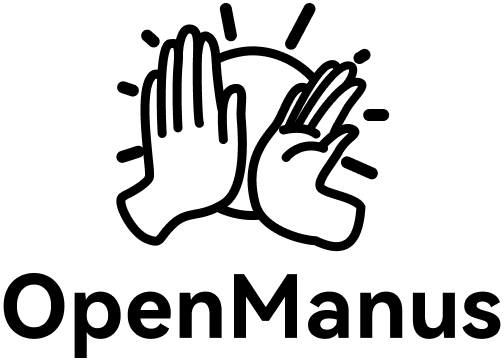

<p align="center">
  
</p>

English | [中文](README_zh.md) | [한국어](README_ko.md) | [日本語](README_ja.md)

[](https://github.com/FoundationAgents/OpenManus/stargazers)
&ensp;
[](https://opensource.org/licenses/MIT) &ensp;
[](https://discord.gg/DYn29wFk9z)
[](https://huggingface.co/spaces/lyh-917/OpenManusDemo)
[](https://doi.org/10.5281/zenodo.15186407)

# 👋 OpenManus

Manus is incredible, but OpenManus can achieve any idea without an *Invite Code* 🛫!

Our team members [@Xinbin Liang](https://github.com/mannaandpoem) and [@Jinyu Xiang](https://github.com/XiangJinyu) (core authors), along with [@Zhaoyang Yu](https://github.com/MoshiQAQ), [@Jiayi Zhang](https://github.com/didiforgithub), and [@Sirui Hong](https://github.com/stellaHSR), we are from [@MetaGPT](https://github.com/geekan/MetaGPT). The prototype is launched within 3 hours and we are keeping building!

It's a simple implementation, so we welcome any suggestions, contributions, and feedback!

Enjoy your own agent with OpenManus!

We're also excited to introduce [OpenManus-RL](https://github.com/OpenManus/OpenManus-RL), an open-source project dedicated to reinforcement learning (RL)- based (such as GRPO) tuning methods for LLM agents, developed collaboratively by researchers from UIUC and OpenManus.

## Project Demo

<video src="https://private-user-images.githubusercontent.com/61239030/420168772-6dcfd0d2-9142-45d9-b74e-d10aa75073c6.mp4?jwt=eyJhbGciOiJIUzI1NiIsInR5cCI6IkpXVCJ9.[POTENTIAL_SECRET_REDACTED].[POTENTIAL_SECRET_REDACTED] data-canonical-src="https://private-user-images.githubusercontent.com/61239030/420168772-6dcfd0d2-9142-45d9-b74e-d10aa75073c6.mp4?jwt=eyJhbGciOiJIUzI1NiIsInR5cCI6IkpXVCJ9.[POTENTIAL_SECRET_REDACTED].[POTENTIAL_SECRET_REDACTED] controls="controls" muted="muted" class="d-block rounded-bottom-2 border-top width-fit" style="max-height:640px; min-height: 200px"></video>

## Installation

We provide two installation methods. Method 2 (using uv) is recommended for faster installation and better dependency management.

### Method 1: Using conda

1. Create a new conda environment:

```bash
conda create -n open_manus python=3.12
conda activate open_manus
```

2. Clone the repository:

```bash
git clone https://github.com/FoundationAgents/OpenManus.git
cd OpenManus
```

3. Install dependencies:

```bash
pip install -r requirements.txt
```

### Method 2: Using uv (Recommended)

1. Install uv (A fast Python package installer and resolver):

```bash
curl -LsSf https://astral.sh/uv/install.sh | sh
```

2. Clone the repository:

```bash
git clone https://github.com/FoundationAgents/OpenManus.git
cd OpenManus
```

3. Create a new virtual environment and activate it:

```bash
uv venv --python 3.12
source .venv/bin/activate  # On Unix/macOS
# Or on Windows:
# .venv\Scripts\activate
```

4. Install dependencies:

```bash
uv pip install -r requirements.txt
```

### Browser Automation Tool (Optional)
```bash
playwright install
```

## Configuration

OpenManus requires configuration for the LLM APIs it uses. Follow these steps to set up your configuration:

1. Create a `config.toml` file in the `config` directory (you can copy from the example):

```bash
cp config/config.example.toml config/config.toml
```

2. Edit `config/config.toml` to add your API keys and customize settings:

```toml
# Global LLM configuration
[llm]
model = "gpt-4o"
base_url = "https://api.openai.com/v1"
api_key = "sk-..."  # Replace with your actual API key
max_tokens = 4096
temperature = 0.0

# Optional configuration for specific LLM models
[llm.vision]
model = "gpt-4o"
base_url = "https://api.openai.com/v1"
api_key = "sk-..."  # Replace with your actual API key
```

## Performance Optimizations

OpenManus includes several performance optimizations to improve response speed and reduce latency:

### Query Management System
The system implements a comprehensive query management system to prevent model crashes or overload:
- **Message Queuing**: Incoming messages are queued with priority-based processing
- **Message Compression**: User messages are compressed to optimize processing speed while maintaining 90% of the original structure
- **Asynchronous Processing**: Queries are processed asynchronously to prevent blocking
- **Rate Limiting**: Concurrent processing is limited to prevent resource exhaustion

For more details, see [QUERY_MANAGEMENT_SYSTEM.md](QUERY_MANAGEMENT_SYSTEM.md).

### Model Loading Optimizations
- Enhanced model loading strategies for faster initialization
- On-demand loading of local LLMs with DirectML GPU acceleration support
- Pre-loading strategies for lightweight models

### Context Management
- Improved context management systems to reduce overhead in conversation history processing
- Chat history caching with intelligent compression
- Optimized state maintenance

### DirectML GPU Acceleration
- Optimized DirectML GPU acceleration configurations including KV cache offloading
- Maximized inference performance on Windows AMD GPUs

### Token Output Processing
- Streamlined token output processing pipelines to minimize bottlenecks
- Optimized response generation and formatting

## Quick Start

One line for run OpenManus:

```bash
python main.py
```

Then input your idea via terminal!

For MCP tool version, you can run:
```bash
python run_mcp.py
```

For unstable multi-agent version, you also can run:

```bash
python run_flow.py
```

### Web UI

To run the web interface:

```bash
python web_ui.py
```

Then open your browser to http://localhost:5000

### Performance Testing

To run performance tests:

```bash
python test_performance.py
```

### Query Management Testing

To test the query management system:

```bash
python test_query_management.py
```

### Custom Adding Multiple Agents

Currently, besides the general OpenManus Agent, we have also integrated the DataAnalysis Agent, which is suitable for data analysis and data visualization tasks. You can add this agent to `run_flow` in `config.toml`.

```toml
# Optional configuration for run-flow
[runflow]
use_data_analysis_agent = true     # Disabled by default, change to true to activate
```
In addition, you need to install the relevant dependencies to ensure the agent runs properly: [Detailed Installation Guide](app/tool/chart_visualization/README.md##Installation)

## 🔒 Security

This repository implements comprehensive security measures to protect sensitive information:

- **Automated Protection**: Scripts automatically identify and protect sensitive files
- **Sensitive Data Redaction**: Hardcoded secrets are automatically detected and redacted
- **Git Hooks**: Pre-commit hooks prevent accidental commits of sensitive information
- **Documentation**: Comprehensive security guidelines in [SECURITY.md](SECURITY.md)

For detailed information about security implementation, see [SECURITY_IMPLEMENTATION_SUMMARY.md](SECURITY_IMPLEMENTATION_SUMMARY.md).

### Security Commands

```bash
# Scan for sensitive information
python security_check.py

# Automatically redact sensitive information
python security_check.py --redact

# Verify protection status
python verify_protection.py

# Update .gitignore with new sensitive files
python protect_repo.py
```

## 📄 License

MIT License

Copyright (c) 2023-2024 Xinbin Liang, Jinyu Xiang, Zhaoyang Yu, Jiayi Zhang, Sirui Hong

Permission is hereby granted, free of charge, to any person obtaining a copy
of this software and associated documentation files (the "Software"), to deal
in the Software without restriction, including without limitation the rights
to use, copy, modify, merge, publish, distribute, sublicense, and/or sell
copies of the Software, and to permit persons to whom the Software is
furnished to do so, subject to the following conditions:

The above copyright notice and this permission notice shall be included in all
copies or substantial portions of the Software.

THE SOFTWARE IS PROVIDED "AS IS", WITHOUT WARRANTY OF ANY KIND, EXPRESS OR
IMPLIED, INCLUDING BUT NOT LIMITED TO THE WARRANTIES OF MERCHANTABILITY,
FITNESS FOR A PARTICULAR PURPOSE AND NONINFRINGEMENT. IN NO EVENT SHALL THE
AUTHORS OR COPYRIGHT HOLDERS BE LIABLE FOR ANY CLAIM, DAMAGES OR OTHER
LIABILITY, WHETHER IN AN ACTION OF CONTRACT, TORT OR OTHERWISE, ARISING FROM,
OUT OF OR IN CONNECTION WITH THE SOFTWARE OR THE USE OR OTHER DEALINGS IN THE
SOFTWARE.

```

```

```

```
